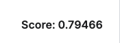
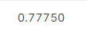

# Disaster-Tweets-Classification

In this project, we applied machine learning models to predict Tweets that are about real disasters. The dataset is provided by Kaggle. There are about  10,000 tweets provided. This project is from kaggle.

## Data Cleaning 
In the data cleaning stage, we have coverted all the tweets into lower case letters. We have retained the occurance of internet slang terms and the period punctuation of the tweets. However, using regual expressions, we removed mentions of other users (words that start with "@"), links, alphanumeric characters (excluding the occurances of periods), and removing occurances of multiple periods or spaces in a row. Furthermore, stopwords were also removed using the [nltk](https://www.nltk.org/) (Natural Language Toolkit). 

### Stemming 
All the tweets in our dataset undergone stemming. Stemming is used to simplify each word in a sentece to its common base form without taking account of the context of the words with in the sentence. We used PorterStemmer from the nltk library to complete this. Porterstemer uses the Porter's algorithm which has list of 5 rules, that are applied sequentially to reduce the words to its base form. 

### Data Engineering
Keyword was given on tweets as a string, so in order to make the information usable by the models we did custom catogroical encoding:
* -1 means there is no keyword
* 0 means there's a keyword, but it's not in the tweet
* 1 means there's a keyword, and it's in the tweet

Location was also given as a string, so encoded as so:
* 0 means a location was _not_ given
* 1 means a location was given

### Text Data Extraction
We first converted the tweets in the training csv data into TF-IDF matrices. TF-IDF stands for term frequency-inverse document frequency and it is a measure that can quantify the importance of string representations in a document. This was done by using the sklearn library. 

## Data Modeling 

### Logistic Regression 
We used SGD (Stochastic Gradient Descent) classifier from the Python sklearn library to train the given tweets. SGD has been applied to large-scale problems encountered in text classification and natural language processing.  In this project, SGD has to be fitted with two arrays as input and output: an array X holding the training tweet's TD- IDF vectors, and an array y holding the target values. After being fitted, the model can then be used to predict new values

we have recieved an accuracy score of approximately 79% using this model in kaggle. 

### XG Boost
We used the XGBRegressor from the xgboost library to train the given tweet. This model is an optimized distributed gradient boosting library designed to be highly efficient, flexible and portable. I set the parameters to 10,000 n_estimators, 0.1 learning rate  and "binary:logistic" objective. 

The XG boost model got an accuracy of 78% on the kaggle submission.

## Resources
-  Kaggle: [Natural Language Processing with Disaster Tweets](https://www.kaggle.com/competitions/nlp-getting-started)
-  [SGD logistic regression](https://scikit-learn.org/stable/modules/sgd.html)

